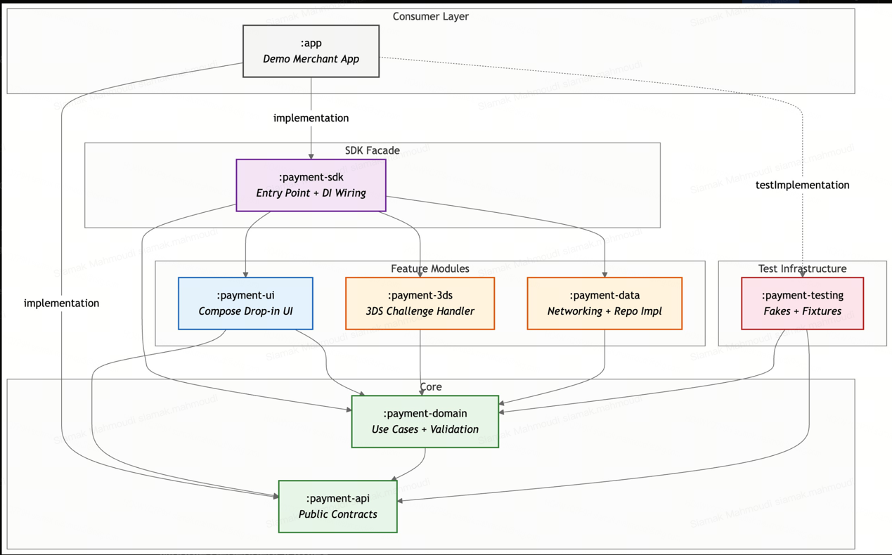
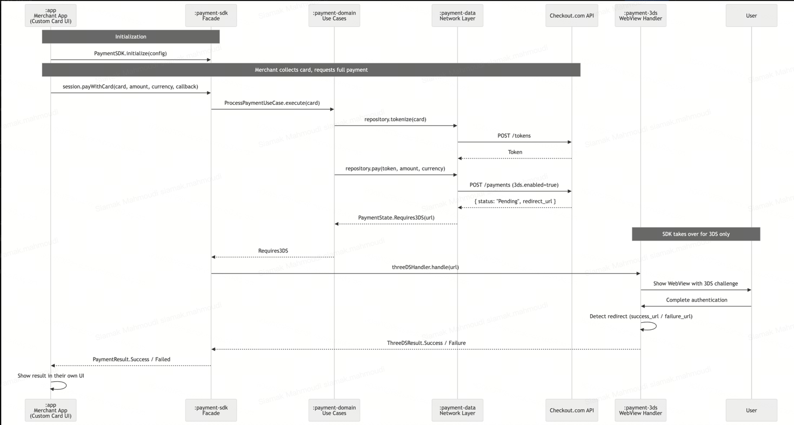
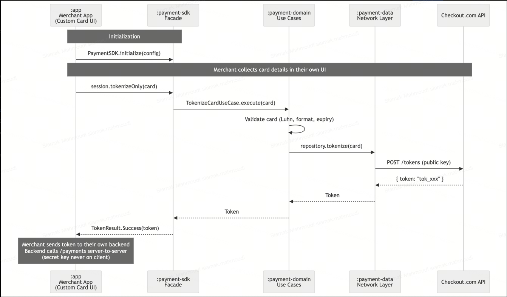
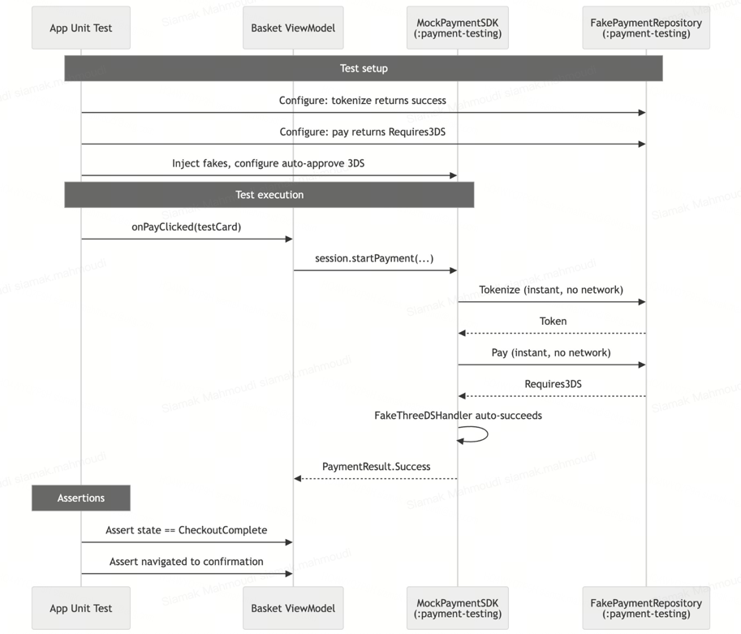

# Checkout.com 3DS Payment Flow

An Android application demonstrating a complete 3D Secure payment flow using the Checkout.com sandbox API.

## Architecture

```
com.checkout.payment/
  domain/          Pure Kotlin business logic (zero Android dependencies)
    model/         Card, Token, PaymentState, PaymentResult, CardScheme, CardValidation
    repository/    PaymentRepository, ThreeDSHandler (interfaces only)
    usecase/       ProcessPaymentUseCase
  data/            API layer (Retrofit + kotlinx.serialization)
    api/           PaymentApi (Retrofit interface)
    model/         Request/response DTOs
    repository/    PaymentRepositoryImpl
  presentation/    Compose UI + ViewModel
    card/          CardInputScreen, PaymentViewModel, CardInputState
    threeds/       ThreeDSScreen (WebView)
    result/        ResultScreen (success/failure)
    navigation/    PaymentNavHost (state-driven navigation)
    theme/         Material3 theming
  platform/        Android-specific concerns
    CheckoutConfig (BuildConfig wrapper)
    ApiFactory     (Retrofit/OkHttp construction)
  di/              Composition root
    AppContainer   (single wiring point)
```

## Key Design Decisions

### Why Manual DI (No Hilt/Dagger)

The composition root pattern (`AppContainer`) provides:
- **Explicit wiring**: Every dependency is visible in one place. No magic annotations, no generated code to debug.
- **Testability**: Swap any dependency by constructing with a different implementation. No test rules or custom components needed.
- **SDK mindset**: If this were extracted into a payment SDK, Hilt would be a transitive dependency forced on consumers. Manual DI avoids this entirely.

Trade-off: For larger apps with dozens of scoped dependencies, a DI framework reduces boilerplate. At this scale, manual DI is strictly better.

### Why Sealed Class State Modeling

`PaymentState` is a sealed class with five variants: `Idle`, `Loading`, `Requires3DS`, `Success`, `Failure`. This gives:
- **Exhaustive `when` expressions**: The compiler enforces handling of every state. Adding a new state is a compile error everywhere it matters.
- **No boolean chaos**: Instead of `isLoading + isError + is3DS` (8 possible combinations, most invalid), we have exactly 5 valid states.
- **State-driven navigation**: The `PaymentNavHost` composable switches screens based on the current `PaymentState`. No NavController imperative calls.

### Why Framework-Agnostic Domain Layer

The `domain/` package contains zero Android imports. `PaymentRepository` and `ThreeDSHandler` are interfaces defined in domain but implemented elsewhere. This means:
- Business logic is unit-testable without Robolectric or instrumented tests.
- The domain layer could be shared across platforms (KMP) without modification.
- Replacing Retrofit with Ktor (or any other HTTP client) requires zero domain changes.

### 3DS Bridge Pattern

The `ThreeDSHandler` interface uses `CompletableDeferred` to bridge the gap between:
- The **ViewModel** (coroutine-based, suspends on `handle(url)`)
- The **WebView** (callback-based, fires `onSuccess`/`onFailure`)

The `ThreeDSDeferredHandler` in `PaymentNavHost` implements this bridge. The ViewModel never knows about WebView, and the WebView never knows about coroutines.

## Payment Flow

### Consumer (demo app) perspective
1. User browses the **Basket** screen with selected products, currency, and total
2. Taps **Checkout** — the SDK's `PaymentFlow` composable takes over with an animated slide transition
3. On success/failure, the SDK calls `onPaymentComplete(Boolean)` — the demo app shows an **Order Result** screen
4. User can **retry** (re-enters PaymentFlow) or **go back to basket**
5. At any point during card input, user can tap **Cancel** to return to the basket

### SDK-internal flow
1. User enters card details — scheme icon animates in as digits are typed, focus auto-advances between fields
2. Client-side validation runs (Luhn, expiry, CVV length, card scheme detection)
3. On "Pay", the card is tokenized via `POST /tokens` (public key auth)
4. The token is used to request payment via `POST /payments` (secret key auth, Bearer)
5. API returns `status: "Pending"` with a 3DS redirect URL
6. WebView loads the 3DS challenge page
7. After user completes 3DS, the page redirects to `success_url` or `failure_url`
8. WebView intercepts the redirect, resolves the deferred, and the result screen appears

## Trade-offs

| Decision | Benefit | Cost |
|---|---|---|
| Manual DI | Explicit, no framework lock-in | More boilerplate at scale |
| State-driven nav | Compile-safe, no navigation bugs | Less flexible for deep-link-heavy apps |
| Single Activity | Simpler lifecycle, Compose-native | WebView in Compose requires `AndroidView` |
| kotlinx.serialization over Moshi | Reflection-free, compiler-plugin-based, KMP-ready | Slightly less mature Retrofit integration (via Jake Wharton's converter) |
| HEADERS-only logging | Prevents card data leaks | Harder to debug request/response bodies |

## Current State

### Module Dependency Graph



### SDK Integration Flows

**Custom UI + SDK-managed 3DS** — the primary flow used by the demo app:



**Headless Tokenization** — for merchants who handle payment server-side:



**Consumer App Testing** — how the shared test infrastructure works:



### What's Implemented

| Area | Status | Details |
|---|---|---|
| **Card input UI** | Done | Compose screen with number/expiry/CVV fields, real-time formatting, auto-advance focus between fields |
| **Card scheme detection & icons** | Done | Real-time scheme detection (Visa, Mastercard, AMEX) with animated vector drawable icons in the card number field |
| **Client-side validation** | Done | Luhn check, expiry validation, CVV length per scheme (3 for Visa/MC, 4 for AMEX), scheme-aware input length limits |
| **Tokenization (Part 1)** | Done | `POST /tokens` with public key auth, pure Kotlin domain layer |
| **Payment request (Part 2)** | Done | `POST /payments` with Bearer secret key, `3ds.enabled: true`, sealed class result mapping |
| **3DS WebView (Part 3)** | Done | WebView loads redirect URL, intercepts success/failure redirect, bridges to coroutine via `CompletableDeferred` |
| **Result screen** | Done | Native success/failure screen with dismiss action |
| **Demo basket screen** | Done | Fake merchant basket with products, currency, userId — demonstrates how a consumer integrates the SDK's `PaymentFlow` composable and handles callbacks |
| **Screen transitions** | Done | Animated directional slide + fade between Basket, Payment, and Result screens |
| **State machine** | Done | `PaymentState` sealed class: `Idle -> Loading -> Requires3DS -> Success/Failure` — drives navigation, no boolean flags |
| **Multi-module architecture** | Done | 8 modules with clean dependency boundaries, SDK facade pattern |
| **Manual DI** | Done | `SDKContainer` composition root, lazy initialization, no Hilt/Dagger |
| **Framework-agnostic domain** | Done | Zero Android imports in `payment-domain`, pure Kotlin interfaces + use cases |
| **Unit tests** | Done | `CardValidationTest` (17 tests), `ProcessPaymentUseCaseTest` (6 tests), `PaymentViewModelTest` (10 tests) — all using fakes from `payment-testing` |
| **SDK integration tests (JVM)** | Done | `PaymentSDKIntegrationTest` in `payment-sdk/src/test` — 3 cross-module tests covering initialization guard, full approved flow, and full 3DS flow; wires real `PaymentViewModel` + `ProcessPaymentUseCase` + fakes from `payment-testing` |
| **Compose UI instrumented test** | Done | `PaymentFlowIntegrationTest` in `payment-sdk/src/androidTest` — renders real Compose UI on device, fills card fields via `performTextInput`, asserts result screen appears and callback fires; enabled by `PaymentFlowInternal` test seam |
| **Shared test infrastructure** | Done | `payment-testing` module with `FakePaymentRepository`, `FakeThreeDSHandler`, `TestFixtures` |
| **Base URL resolution** | Done | SDK-internal (`Resolver.kt`), not exposed to consumers — demo app only provides `Environment.SANDBOX` |
| **Error handling** | Done | `PaymentError` sealed class (`Network`, `Declined`, `Validation`, `Unknown`) mapped from HTTP codes |

### Test Summary

- **`payment-domain`**: 23 tests — Luhn algorithm, card number/expiry/CVV validation, scheme detection, use case happy + error paths
- **`payment-ui`**: 10 tests — ViewModel state transitions, form validation, 3DS flow, reset behavior
- **`payment-sdk`**: 3 JVM integration tests (initialization guard, approved flow, 3DS flow) + 1 Compose UI instrumented test (full card input → success screen on device)

### What's Not Implemented (Yet)

See the roadmap below.

## Roadmap / Future Improvements

If given more time, these are the improvements I'd prioritize (in order):

### High Priority
- **Scheme-aware card formatting**: AMEX uses 4-6-5 grouping (`3782 822463 10005`), currently all schemes use 4-4-4-4
- **Retry logic**: Exponential backoff on network failures with configurable max attempts
- **Payment status polling**: After 3DS, poll `GET /payments/{id}` for final status instead of relying solely on redirect URL detection
- **Accessibility**: Content descriptions, focus management, TalkBack testing — the challenge lists this as a nice-to-have and it should be table stakes
- ~~**Instrumented tests**~~: Done — `PaymentFlowIntegrationTest` in `payment-sdk/src/androidTest` covers the full card input → result flow using `FakePaymentRepository` (no real network)

### Medium Priority
- **Consumer-facing test doubles**: Publish a `FakePaymentSdk` so merchants can test their integration without network calls (current `payment-testing` fakes are internal-only)
- **Tokenization caching**: Avoid re-tokenizing on retry if the card hasn't changed
- **KMP domain module**: Extract `payment-domain` and `payment-data` into a Kotlin Multiplatform shared module — the domain layer is already pure Kotlin, and `kotlinx.serialization` DTOs are KMP-compatible out of the box
- **API contract versioning**: Version the public contracts in `payment-api` so consumers on SDK v1.0 get deprecation warnings and a clear upgrade path when v2.0 ships, instead of a wall of compile errors

### Low Priority
- **Biometric confirmation**: Require fingerprint/face before submitting payment
- **ProGuard/R8 rules**: Full obfuscation config for release builds
- **Analytics hooks**: Let consumers observe payment events (tokenize started, 3DS opened, payment completed) for their own telemetry

## Test Cards

| Outcome | Number | Expiry | CVV |
|---|---|---|---|
| Success | 4242 4242 4242 4242 | 06/30 | 100 |
| Failure | 4243 7542 7170 0719 | 06/30 | 100 |

## Configuration

Sandbox API keys and URLs are stored in `gradle.properties` (rather than `local.properties`) so that Gradle exposes them directly as project properties — no manual `Properties()` loading needed. In production, these would be injected via CI environment variables or a secrets manager.

## Building

```bash
./gradlew assembleDebug
```

## Running Tests

```bash
./gradlew test
```
